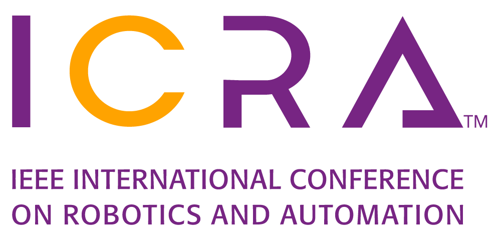

**This repository is incomplete - it is a work in progress**

# [Neural Encodings for Energy-Efficient Motion Planning ](paper.pdf)

[Jocelyn Zhao*](www.linkedin.com/in/jocelyn-zhao), [Deval Shah*](https://www.linkedin.com/in/deval-shah-91485867/), [Tor M. Aamodt](https://www.ece.ubc.ca/~aamodt/)

\* Equal contribution

**Instructions for use**
=================

2D benchmark
---


3D benchmark
---

Kinova 6DOF Robot Arm benchmark
---

The project is tested in Ubuntu 18.04 using ROS Melodic. Install ROS Melodic and Move-It following the instructions [here](https://www.google.com/). Make sure to source the ROS environment in all terminals before running any commands listed below.
```
source /opt/ros/melodic/setup.bash
```

Once all dependencies are installed, build the package as follows:
```
cd bel_motion_planner/kinova_ws
catkin_make
```

Clone the kinova repository to use RViz with the Kinova robot into the src folder. Follow the instructions in their [repository](https://github.com/Kinovarobotics/kinova-ros.git), making sure to clone the melodic-devel branch.
```
cd kinova_ws/src
git clone -b melodic-devel git@github.com:Kinovarobotics/kinova-ros.git kinova-ros
cd ..
catkin_make
```

Make sure to source your build.
```
source install/setup.bash
```

### For Inference
Launch the RViz in one terminal using the following command:

```
roslaunch j2n6s300_moveit_config j2n6s300_virtual_robot_demo.launch
```

In another terminal, launch the ROS node for inference. Set up the parameters for your trained model in the [inference.yaml](kinova_ws/utils/inference.yaml) file. You can download the data 

### For Training

### For Data Collection

## Citation

If you find this project useful in your research, please cite:

```
​```
@inproceedings{BEL-ICRA2025,
  author    = {Shah, Deval and Zhao, Jocelyn and Aamodt, Tor M. },
  booktitle = {International Conference on Robotics and Automation},
  title     = {Neural Encodings for Energy-Efficient Motion Planning},
  url       = {https://github.com/ubc-aamodt-group/bel_motion_planners/blob/main/paper.pdf},
  month     = {May},
  year      = {2025},
}
​```
```
